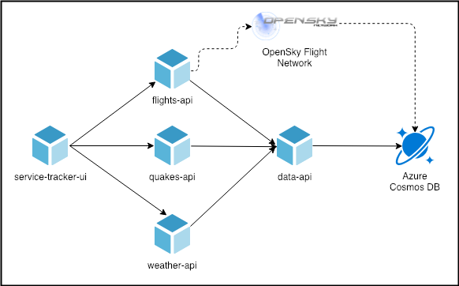

# Kubernetes Challenge
During this Kubernetes Challenege your team will work on the implementation of implementing Kubernetes, monitoring, and delivering services with zero downtime deployments.

Any resemblance to actual scenarios, issues, or pain points that you are facing is not purely coincidental. The definitions of the challenges that will be presented to you during this event are inspired from real life.

## Context 

Your team is of a fictitious insurance company. The company is offering their customers the ability to evaluate natural disasters. A application collects the data from multiple external data providers and sends them to a set of APIs which evaluates flight data, earthquake data, and current tempatures. Your customers can connect to a web application that uses the same APIs to review current data worldwide. Any downtime of the APIs would greatly impact your business.

**Your challenge, should you accept it, is to update the APIs to incorporate any business requirements while keeping the application functional.**

The success of your team depends on your ability to perform those updates and minimize the downtime of your application.

## Architecture
The application is composed of:

- Service UI - Frontend website that customers are using to review natural disaster data.
- Flights API - The Flights API pulls data from OpenSky Flight Network.
- Quakes API - The Quakes API pulls data from national weather service to provide historical earthquake data.
- Weather API - The Weather API pulls data from national weather service to provide current tempatures.
- Data API - Data API is used to store data in MongoDB that aggregates all the above API data.
- MongoDB - Is used to store all external retrieved data.

The following diagram shows the overall architecture:

## Keep the lights up
If one API becomes unavailable, your overall up-time will decrease and impact your score. There is no “maintenance window”, you will have to think of your strategy for a zero downtime deployment.

-----------------
## Cheat Sheet

Need to add Info

-----------------
## Contributing

This project welcomes contributions and suggestions.  Most contributions require you to agree to a
Contributor License Agreement (CLA) declaring that you have the right to, and actually do, grant us
the rights to use your contribution. For details, visit https://cla.microsoft.com.

When you submit a pull request, a CLA-bot will automatically determine whether you need to provide
a CLA and decorate the PR appropriately (e.g., label, comment). Simply follow the instructions
provided by the bot. You will only need to do this once across all repos using our CLA.

This project has adopted the [Microsoft Open Source Code of Conduct](https://opensource.microsoft.com/codeofconduct/).
For more information see the [Code of Conduct FAQ](https://opensource.microsoft.com/codeofconduct/faq/) or
contact [opencode@microsoft.com](mailto:opencode@microsoft.com) with any additional questions or comments.
